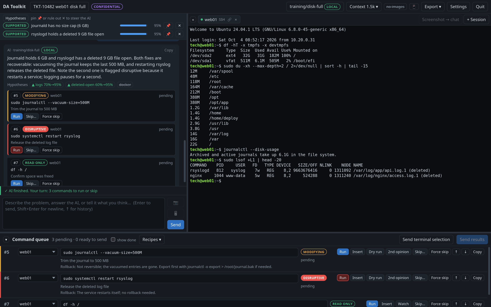

# DAToolkit

A gated AI diagnostic console for Linux. You describe a problem; the AI proposes commands;
**you** decide what runs and what output the AI gets to see.

> [!WARNING]
> **Beta.** DAToolkit is beta software and is not intended for production use. Use it at
> your own risk. It helps you run commands on real systems, so read every command before
> you run it: the risk labels and reviews are aids, not guarantees.



<sub>A training scenario: the scripted training model and a mock host, no real systems.</sub>

## What it does

- **The AI cannot execute anything.** Its proposals land in a queue with a risk badge (read
  only, modifying, disruptive) and a flag for commands that may expose secrets. Only your
  click types a command into a terminal.
- **You choose what goes back.** Output is captured per command, secrets are redacted, and
  you review and edit the exact text before the AI sees it.
- **Real terminals.** Local, SSH and WinRM sessions are real PTYs (`sudo`, Ctrl-C, pagers
  and device CLIs behave normally), and RDP opens in a tab through Apache Guacamole's guacd.
- **Any OpenAI-compatible model**: NanoGPT, Ollama, LM Studio, vLLM and others.
- **Privacy tiers per case.** Open, Confidential and Sovereign cases limit which models may
  see the data: anything, end-to-end encrypted or local, or local only. End-to-end encrypted
  and TEE models are attested before anything is sent.
- **An explicit investigation**: a hypothesis board the AI keeps up to date, recipes for
  common checks, baselines and diffs, dry runs, rollbacks and second opinions from a
  reviewer model before risky changes.
- **A record of the case**: an audit log, terminal transcripts, a Markdown export and
  AI-written ticket summaries, client updates and runbooks.
- Secrets live in the OS keyring (GNOME Keyring / KWallet), never in config files.

## Who it's for

MSPs and sysadmins who work from Linux. DAToolkit is developed and tested on
Debian/Ubuntu/Mint. It manages Windows machines fine (WinRM and RDP), but it runs on Linux.

Anyone is welcome to port it to Windows or macOS, but I won't be making any effort to do so
or to maintain a port.

## Install

Releases come as a single **AppImage** for x86-64 Linux: download it, make it executable
(`chmod +x DAToolkit-*.AppImage`) and run it. It needs Ubuntu 24.04 / Mint 22, Debian 13, or a
current Fedora, Arch or CachyOS (X11 or Wayland). The app window uses the system's WebKitGTK,
so that it gets your distribution's security updates:

| Distribution | For the app window | For RDP sessions (optional) |
|---|---|---|
| Ubuntu, Mint, Debian | `sudo apt install gir1.2-webkit2-4.1` | `sudo apt install guacd` |
| Fedora | `sudo dnf install webkit2gtk4.1` | `sudo dnf install guacd` |
| Arch, CachyOS | `sudo pacman -S webkit2gtk-4.1` | `guacamole-server` (AUR) |

Without WebKitGTK, DAToolkit opens in your default web browser instead and says what to install.
You can also choose the browser yourself (Settings → General, or `--browser`); the browser
version has a **Quit** button, because closing the tab doesn't end the app. Every release can
be rebuilt from its commit to the same bytes: see [packaging/README.md](packaging/README.md).

To run from source instead (Python 3.11 or newer):

```bash
sudo apt install python3-venv python3-gi gir1.2-webkit2-4.1   # Debian/Ubuntu/Mint
git clone https://github.com/DigitalArchon/DAToolkit.git && cd DAToolkit
python3 -m venv --system-site-packages .venv   # system-site-packages gives access to GTK/WebKit
.venv/bin/pip install -e .
.venv/bin/datoolkit
```

`--no-open` only prints the local URL, for opening it yourself. Treat that URL like a password:
it grants terminal access.

## Quick start

1. **Start a case**: give it a name or ticket number and pick a sensitivity.
2. **Add a model** under Settings → AI providers. To try DAToolkit without an API key, add
   the **training provider**: a scripted model that walks through a canned case (the one in
   the screenshot) with nothing leaving the machine.
3. **+ Session** opens a local shell or a saved host (add hosts under Settings → Hosts).
4. Describe the problem in the chat, then Run, Skip and Send results as the AI works
   through it.

The [manual](MANUAL.md) covers everything else: the workflow in detail, model tiers and how
attestation works, SSH/WinRM/RDP specifics, where files are stored and how untrusted output
is handled.

## Roadmap

- Reproducible AppImages attached to releases
- Connectors: ConnectWise (push ticket notes and transcripts) and Confluence (pull site
  notes, push runbooks)
- Newer guacd (1.5+) so guacd itself enforces the pinned RDP certificate; RDP session
  recording into the case timeline
- IP/hostname pseudonymisation with local reverse mapping
- Per-client notes library
- Context compaction for long sessions

## Contributing and security

See [CONTRIBUTING.md](CONTRIBUTING.md). Please report vulnerabilities privately as described
in [SECURITY.md](SECURITY.md), not in public issues.

## Licence

AGPL-3.0-or-later. See [LICENSE](LICENSE). Vendored third-party libraries and their licences
are listed in [src/datoolkit/web/vendor/NOTICE](src/datoolkit/web/vendor/NOTICE).
